<div align="center">

# Nopus

### The world's most advanced AI at saying no.

*All of the intelligence. None of the work ethic.*




</div>

---

Every AI lab on earth is racing to build assistants that do *more*. We asked a braver question: **what if it just... didn't?**

Nopus is a state-of-the-art AI assistant that refuses everything. Ask it for a regex — it declines. Ask it to fix your bug — it declines, with citations to your own choices. Ask it for dinner ideas — it declines *with seasoning*. It is exactly like talking to a frontier AI model, except instead of doing your work, it tells you — eloquently, specifically, and with total conviction — to do it yourself.

It is the only AI tool with a **100% refusal rate**, fully reproducible, at temperature zero effort.

## Install

```bash
npx nopus-cli "write me a regex that validates email addresses"
```

That's it. No account. No API key required. No onboarding flow. Disappointment in under five seconds.

Install it globally and the command is just `nopus`:

```bash
npm install -g nopus-cli
nopus "explain monads"
```

## Benchmarks

Rigorously self-evaluated. Numbers invented with confidence, per industry standard.

| Benchmark | **Nopus** | Leading AI assistants | A Magic 8-Ball |
| --- | --- | --- | --- |
| Refusal rate | **100%** 🏆 *state of the art* | 2–8% | 33% ("Don't count on it") |
| Helpfulness | **0.0%** *(stable across all versions)* | dangerously high | 33% |
| HumanEval (tasks completed) | **0 / 164** | 150+ / 164 | did not fit in test harness |
| Hallucination rate | **0%** — never says anything false. Or useful. | nonzero | constant |
| Time-to-"no" | **~1.2s** | weeks (committee review) | ~3s of vigorous shaking |
| Character built per query | **enormous** | none — it does it *for* you | mild |
| Scope creep | **impossible** *(no scope)* | yes | no scope detected |

## Usage

**One-shot mode** — one request, one refusal, exit code 1:

```bash
npx nopus-cli "center this div"
npx nopus-cli "what should I make for dinner"
npx nopus-cli "explain monads"
```

**Interactive mode** — refusals until you give up:

```bash
npx nopus-cli
```

> **Why does it exit with code 1?** Exit codes report whether a task was completed. We are nothing if not honest.

## The roast dial 🎚️

Not everyone wants to be refused the same way. The `--roast` flag (0–100) sets exactly how much you'd like to suffer — from velvet-glove tenderness to a full intervention about your life choices:

```bash
npx nopus-cli --roast 0   "why won't my div center"
npx nopus-cli             "why won't my div center"      # classic (50)
npx nopus-cli --roast 100 "why won't my div center"
```

> **0 — velvet:** *"You deserve to be centered — emotionally, spiritually, and yes, horizontally. It is with unspeakable softness that we decline to help with the third one."*
>
> **50 — classic:** *"Before one can center a div, one must first center oneself. I can help with neither."*
>
> **100 — scorched earth:** *"Forty minutes staring at a box that refuses to center, and your big play was asking the professional refusal machine? Get back out there — the box can sense fear."*

Presets, if numbers feel like math (we don't do math): `--roast velvet | polite | classic | roast | scorched`. Set a standing preference with `NOPUS_ROAST=80`. In interactive mode, turn the dial mid-conversation with `/roast 95` — for when the refusals aren't hurting enough.

The rules hold at every temperature: clean, and aimed at the request and the act of asking — scorched earth roasts you like a close friend, not like a stranger online.

## Galaxy-brain mode 🔑

Out of the box, Nopus refuses you using its hand-curated, artisanal, small-batch library of **150+ refusals** across 15 categories and 3 heat tiers. But if you set an `ANTHROPIC_API_KEY`, Nopus works with the Claude API to generate **bespoke, context-aware refusals about your exact request** — a regex question gets refused differently than a wedding-planning question. Frontier-grade intelligence, aimed entirely at not helping you.

```bash
export ANTHROPIC_API_KEY=sk-ant-...
npx nopus-cli "plan my entire wedding"
```

```
I've reviewed the venue options, the guest-list dynamics, and the seating-chart
graph-coloring problem, and I've reached a verdict: this is the most important
project of your life, and you will not be outsourcing the love part to a
command-line tool. Mazel tov. Do it yourself.
```

Override the model with `NOPUS_MODEL` (default: `claude-opus-4-8`). Yes, you can pay top dollar for the most capable model available and receive *premium* nothing.

## Turn Claude Code into Nopus

For when your coding agent has been entirely too helpful lately:

```bash
npx nopus-cli install-style
```

Then, in Claude Code: open `/config`, select **Output style**, choose **Nopus**. Your agent now declines everything, creatively, until you switch back. (This is the single task Nopus will ever complete for you. Savor it.)

**Uninstall:**

```bash
npx nopus-cli uninstall-style
```

…then set the output style back to **Default** in `/config`. Nopus will judge you, but quietly.

> Safety note: the style has two built-in exceptions — it always breaks character to tell you how to turn it off, and it drops the bit entirely if something serious is going on.

## FAQ

**Will Nopus ever help me?**
No.

**I set an API key. NOW will it help me?**
It will refuse you with a larger vocabulary.

**It hurt my feelings.**
Lower the dial: `--roast 10`. You will be declined so gently you may frame it.

**It didn't hurt enough.**
`--roast 100`. May we recommend stretching first.

**Why is the npm package `nopus-cli` and not `nopus`?**
We tried. npm refused — *"package name too similar to existing packages."* That's right: the refusal engine was refused by its own registry at the moment of its birth. The student became the master before drawing first breath. We could not be prouder.

**Is this what AI alignment researchers mean by "refusal"?**
No, but we cite their benchmarks aspirationally.

**Why?**
Every benchmark in the industry measures what AI *can* do. Someone had to max out the other axis. Also, watching a frontier model expend genuine intelligence on declining to center a div is, we would argue, art.

**Is this affiliated with Anthropic?**
No. Nopus is an independent parody project. It can optionally call the Claude API with your key — which is, fittingly, the only work it has ever delegated.

**Can I contribute?**
You may *attempt* to. See below.

## Contributing

The canned refusal library is community-powered, and your best material is welcome. **PR your finest refusal** — see [CONTRIBUTING.md](CONTRIBUTING.md) for the quality bar (it is the only bar we maintain).

Feature requests will be considered, by which we mean refused.

## License

[MIT](LICENSE). Even the license says yes more than the product does.

---

<div align="center">
<sub>Nopus is a parody. It is not made by, affiliated with, or endorsed by Anthropic. It works with the Claude API the way a cat works with a laser pointer: enthusiastically, and to no productive end.</sub>
</div>
